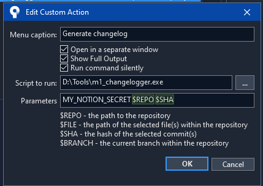

# Changelogger for git and notion

> ## 🚧 WIP Notice 🚧
> Right now the tool may not be usable as-is to everyone because:
> - Notion database ID is hardcoded in notion.py
> - it assumes that issue ID is formatted precisely as `ID-{number}`
> - To customize emojis, titles or commit types, source code has to be modified.
>
> This however shouldn't stop you from modyfing this tool to suit your needs.


A simple tool that takes a list of commit shas with conventional messages, finds optional Issue/Task ids in them, matches them with a Notion database and creates a pretty changelog:

>➕ Added:
>- [[39e43cc](https://github.com)] feat(scope): add some cool stuff - User1
>
>🛠 Fixed:
>- [[ID-60](https://www.notion.so/)] [[93b3ea2](https://github.com)] fix(ui): ID-60 change tmp substitution character from 9633 (square) to 8203 (zero width space) so it's not visible - User1
>- [[997a9bb](https://github.com)] fix(scope): play button getting truncated on collapsed posts with videos - User1
>- [[35b526a](https://github.com)] fix: safe area messes up anchors - User2
>- [[ID-50](https://www.notion.so)] [[314c0a9](https://github.com)] fix(scope): not all parts of ui being clickable ID-50 - User1
>- [[54c8d6c](https://github.com)] fix: Infinite scroll instatiates only 4 entries - User2
>
>🚀 Optimized:
>- [[f4c4feb](https://github.com)] perf(scope): scroll rect occlusion - User1
>
>🤷‍ Other:
>- [[2cf8fe7](https://github.com)] style(scope): fix more_arrow_down background not being perfectly transparent - User1
>- [[ID-51](https://www.notion.so/)] [[8f601cb](https://github.com)] style(scope): minor news header layout and font adjustments ID-51 - User1
>- [[e824275](https://github.com)] style(scope): removed yellow color from instagram gradient texture to make it more gentle - User1
>- [[ID-52](https://www.notion.so/)] [[1c31058](https://github.com)] style(scope): new arrow expandable news indicator ID-52 - User1


## Usage

See [releases](https://github.com/bartoszblachucki/GitNotionChangelogger/releases) for prebuilt binaries.
Pyinstaller with `--onefile` option is used to build the executable so **python is not required to run it**.
Place the executable anywhere in your PATH if you intend to use it from command line.

```batch
> m1_changelogger.exe MY_NOTION_SECRET d:/path/to/repo COMMITSHA1 COMMITSHA2 COMMITSHA3
```

`MY_NOTION_SECRET` can be acquired from [Notion integrations page](https://www.notion.so/my-integrations) by the Teamspace owner. 
Contact your Teamspace owner if you don't have access to it.

Output is printed to stdout and **copied to clipboard**.

## SourceTree integration
This tool was created to be used as a SourceTree custom action.

### Custom Action configuration
<p align="center">
  
</p>

### Custom action usage
<p align="center">
  
</p>

## How to build
Python 3.8 with pyinstaller is required to build the executable.
    
    ```batch
    > pyinstaller --onefile --icon=icon.ico m1_changelogger.py
    ```

You can also use the provided `build.bat` script.

## Used By
This project is used by the following companies:

- GameDev Tube sp. z.o.o.

